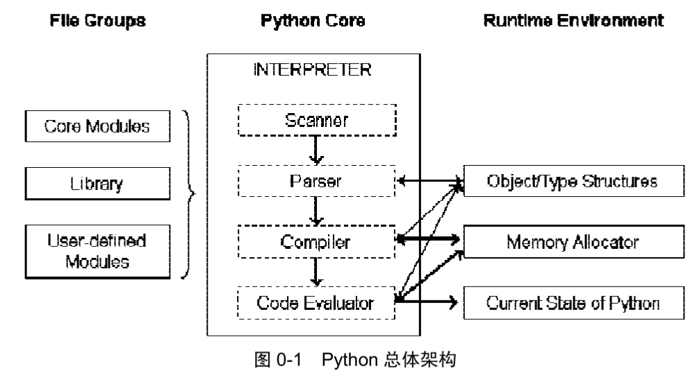
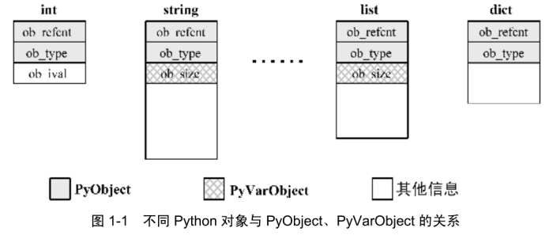

# Python源码剖析

> version = 2.5

## 0.0 注意事项

1. Python2.5自定义了新的类型Py_ssize_t，一般以int视之

2. 直至2.5版本，Python有一套相当复杂的内存管理机制和相当混乱的内存管理接口。因为创建对象必先分配内存，就必须通过内存管理接口，所以对内存管理接口进行一些概念上的简化

   > 通常Python的源码会使用PyObject_GC_New、PyObject_GC_Malloc、PyMem_MALLOC、PyObject_MALLOC等API：
   >
   > * 凡以**New**结尾的，都以C++中的**new操作符**视之
   > * 凡以**Malloc**结尾的，都以C中的**malloc操作符**视之

## 0.1 Python总体架构

> 在最高层次上，Python的整体架构可以分为3个主要部分



* 左边(File Groups)：Python提供的模块、库以及用户自定义的模块
* 右边(Runtime Environment)：Python的运行时环境，包括**对象/类型系统、内存分配器、运行时状态信息**
  * 对象/类型系统：包含Python内建对象(int、list、dict)及用户自定义的类型和对象
  * 内存分配器：全权负责Python创建对象时对内存的申请，实际是Python运行时与C中malloc的一层接口
  * 运行时状态：维护解释器在运行字节码时不同状态之间的切换
* 中间(Python Core)：Python解释器

## 0.2 Python源代码的组织结构

* **Include**：Python提供的头文件，用户使用C/C++编写自定义模块拓展Python时使用
* **Lib**：Python编写的所有Python标准库
* **Modules**：C编写的对速度有严格要求的模块(random、cStringIO...)
* **Parser**：包含Python解释器中的Scanner和Parser部分，对Python源代码进行词法和语法分析的部分。还包含能根据Python语法自动生成分析器的工具
* **Objects**：所有Python内建对象(int、list、dict...)，还包括运行时需要的所有内部使用对象的实现
* **Python**：包含解释器中的编译器和执行引擎部分，***核心***
* **PCbuild**：VS2003工程文件，编译用
* **PCbuild8**：VS2005工程文件，编译用

### 0.2.1 Unix/Linux环境下编译安装Python

> 按照标准tarball安装软件流程：
>
> ```shell
> ./configure -prefix=自定义安装路径 enable-shared		# enable-shared指令使编译产生的Python可执行文件是动态链接的
> make
> make install
> ```

---

## 1.0 Python内建对象

> **对象**是Python最核心的一个概念（万物皆对象）；千差万别的对象之间存在复杂的关系，构成了称之为“类型系统”或“对象体系”的东西
>
> > **重点**：
> >
> > 1. 了解对象在Python内部是如何表示的以及其在C的层面的模样
> > 2. 类型对象在C层面的实现，初步认识类型对象的作用及其与实例对象的关系

## 1.1 Python内的对象

> 通常说，对象是数据以及基于这些数据的操作的集合
>
> 在计算机中，一个对象实际就是一片被分配的内存空间，这些内存可能是连续或离散的，这片内存在更高层次上可以作为一个整体考虑，这个整体就是一个**对象**
>
> 在这片被分配的内存中存储着一系列数据以及用来对这些数据进行操作的代码
>
> 在Python中，对象就是为C中的**结构体**在堆上申请的一块内存
>
> 对象一般是不能静态初始化的，并且不能在栈空间上生存，唯一的例外就是**类型对象**，Python所有内建类型对象(int、str...)都是被静态初始化了的
>
> Python中，一个**对象一旦被创建**，**在内存中的大小不变**，因此<u>需要容纳可变长度数据的对象只能维护一个指向一块大小可变的内存区域的指针</u>，**原因**：
>
> > 可以使通过指针维护对象变得简单（**C的指针指向内存区块的起始地址**）
> >
> > 一旦允许对象的大小可以在运行期间动态改变，当内存中存在对象A，其后紧跟对象B，如果运行期某个时刻A增大，就必须将A整个移动到内存中的其他位置，否则A增大的部分将覆盖原本属于B的数据
> >
> > 只要将A移动位置，那么所有指向A的指针就必须立即更新，工作繁琐

### 1.1.1 对象机制的基石——PyObject

> Python中所有东西都是对象，在**PyObject中定义了每个Python对象相同的内容**，<u>PyObject是整个*Python对象机制的核心（引用计数 + 类型信息）*</u>
>
> ```c
> [object.h]
> typedef struct _object {
> 	PyObject_HEAD
> } PyObject;
> ```
>
> 这个结构体是Python对象机制的核心基石，Python对象的秘密都隐藏在PyObject_HEAD这个宏中
>
> ```c
> [object.h]
> # ifdef Py_TRACE_REFS
> /* Define pointers to support a doubly-linked list of all live heap objects. */
> 	# define _PyObject_HEAD_EXTRA		\
> 		struct _object *_ob_next;	\
> 		struct _object *_ob_prev;
> 	# define _PyObject_EXTRA_INIT 0, 0,
> # else
> 	# define _PyObject_HEAD_EXTRA
> 	# define _PyObject_EXTRA_INIT
> # endif
>
> /* PyObject_HEAD defines the initial segment of every PyObject. */
> # define PyObject_HEAD		\
> 	_PyObject_HEAD_EXTRA	\
> 	int ob_refcnt;		\
> 	struct _typeobject *ob_type;
> ```
>
> 在VS的release模式下编译Python时，不会定义符号Py_TRACE_REFS，所以在实际发布的Python中，**<u>PyObject的定义</u>**非常简单：
>
> ```c
> [object.h]
> typedef struct _object {
> 	int ob_refcnt;
> 	struct _typoobject *ob_type;
> } PyObject;
> ```
>
> 整型变量 **ob_refcnt** 与Python的内存管理机制有关，它**实现了基于<u>引用计数</u>的<u>垃圾回收机制</u>**
>
> 对于对象A，当有一个新的 PyObject * 引用该对象，A的引用计数应增加；当这个 PyObject * 被删除，A的引用计数应减少；当A的应用计数减为0时，A就可以从堆上删除以释放内存
>
> ob_type是一个指向_typeobject结构体的指针，这个结构体对应Python内部的一种特殊对象（用来指定一个对象的类型的类型对象）
>
> **每个Python对象还占有额外的内存放置各自不同的内容**：
>
> ```c
> [intobject.h]
> typedef struct {
> 	PyObject_HEAD
> 	long ob_ival;
> } PyIntObject;
> ```
>
> Python整数对象中，除PyObject外，还有一个额外的**long变量ob_ival**；一个整数应该有一个“值”，这个“值”的信息就保存在ob_ival中；同样，str对象、list对象、dict对象...都在PyObject之外保存了自己的独有信息

### 1.1.2 定长对象和变长对象

> 区别：是否包含可变长度数据；定长对象的不同对象占用一样大小的内存，而变长对象的不同对象占用的内存可能不一样

> **定长对象**——整数对象的特殊信息是一个C中的整形变量(ob_ival)，无论其值大小都可以保存在ob_ival中
>
> **变长对象**——对于字符串对象，类似PyIntObject，也应该维护“一个字符串”，但在C中没有“一个字符串”概念，准去的说法是：字符串对象应该维护“n个char型变量”。这种对象实际上不光是字符串对象，比如对应于C++中的list或vector的列表对象，它也应该维护“n个PyObject对象”。这种“n个......”也是一类Python对象的共同特征，因此还有一个表示这类对象的结构体——**PyVarObject**：
>
> ```c
> [object.h]
> # define PyObject_VAR_HEAD		\
> 	PyObject_HEAD		\
> 	int ob_size; /* Number of items in variable part */
> 	
> typedef struct {
> 	PyObject_VAR_HEAD
> } PyVarObject;
> ```
>
> 整数对象“1”和“100”占用内存大小都是sizeof(PyIntObject)，而字符串对象“Python”和“C”占用的内存大小不同。这种区别导致了PyVarObject对象中**ob_size**的出现。
>
> 变长对象通常都是容器，ob_size指明了变长对象中一共容纳了多少元素（元素的个数，不是字节的数量）
>
> 从PyObject_VAR_HEAD的定义可见，PyVarObject实际上只是对PyObject的扩展。因此对于任何一个PyVarObject，其占用的内存开始部分的字节的意义和PyObject是一样的，即Python内部每一个对象都有相同的对象头部，这使得在Python中，**只用一个PyObject*指针就可以引用任意一个对象**，不论它实际是什么对象
>
> 下图显示了Python中不同对象与PyObject、PyVarObject在内存布局上的关系：
>
> 
>
> 

 